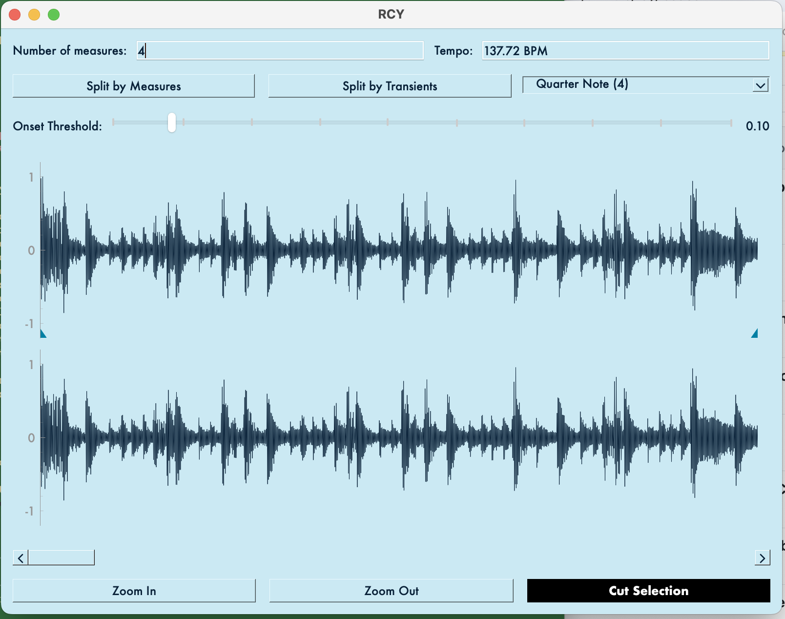

# RCY

**RCY** is a terminal-based breakbeat slicer for cutting drum loops into samples and exporting them in the **SFZ** format for samplers like **TAL-Sampler**. Inspired by New Order's Movement, brutalist design, and hauntological software.

```
┌──────────────────────────────────────────────────────────────────────┐
│ amen.wav  137.7 BPM  4 bars  4 slices                                │
├──────────────────────────────────────────────────────────────────────┤
│L                ▼                ▼                ▼                 R│
│▇▄▆▁▅▂▂▂▂▂▂▃▅▅▁▂▁▆▃▄▅▁▅▁▁▂▂▂▃▅▅▄▁▂▁▆▂▆▂▅▃▂▁▂▂▂▇▁▃▁▅▂▂▂▃▄▆▅▁▂▂▂▃▇▃▃▂▅▃▃│
│▇▄▆▁▅▂▂▂▂▂▂▃▅▅▁▂▁▆▃▄▅▁▅▁▁▂▂▂▃▅▅▄▁▂▁▆▂▆▂▅▃▂▁▂▂▂▇▁▃▁▅▂▂▂▃▄▆▅▁▂▂▂▃▇▃▃▂▅▃▃│
│        1                2                 3                4         │
│0.00s                            3.49s                           6.97s│
└──────────────────────────────────────────────────────────────────────┘
```

## Quick Start

```bash
git clone https://github.com/tnn1t1s/rcy.git
cd rcy
pip install -r requirements.txt
just tui                         # Launch with Amen break
just tui-preset think_break      # Launch with Think break
```

## Usage

### Launch

```bash
just tui                    # Load default (Amen break)
just tui-preset <id>        # Load specific preset
```

### Keyboard Controls

| Key | Action |
|-----|--------|
| `1-0` | Play segments 1-10 |
| `q-p` | Play segments 11-20 |
| `Space` | Play L to R selection |
| `Escape` | Stop playback |
| `/` | Enter command mode |
| `Up/Down` | Navigate command history |
| `Ctrl-R` | Reverse search history |

### Commands

Type `/` to enter command mode, then:

```
/preset <id>              Load preset by ID
/presets                  List available presets
/open <file.wav>          Load audio file

/slice <n>                Slice by measure count
/slice --transients <n>   Slice by transients (0-100)
/slice --clear            Clear all slices

/set bars <n>             Set number of bars (recalculates BPM)
/markers <start> <end>    Set L/R markers (seconds)
/markers --reset          Reset markers to full file

/tempo <bpm>              Set adjusted playback tempo
/tempo --measures <n>     Calculate source tempo from measures

/play 1 2 3 4             Play pattern once (1-0 = segments 1-10)
/play q w e r             Play segments 11-14 (q-p = segments 11-20)
/play 1 q 2 w --loop      Mix numbers and keys, loop pattern
/loop                     Loop all segments (shortcut for /play --loop)
/stop                     Stop playback

/export <dir>             Export SFZ + samples
/zoom in|out              Zoom view
/help                     Show help
/quit                     Exit
```

## Presets

RCY includes classic breakbeats ready to slice:

### Core Breaks

| ID | Name | Artist | Bars |
|----|------|--------|------|
| `amen_classic` | Amen Break | The Winstons | 4 |
| `think_break` | Think (About It) | Lyn Collins | 1 |
| `apache_break` | Apache | Incredible Bongo Band | 2 |
| `apache_L` | Apache (Left Channel) | Incredible Bongo Band | 2 |
| `apache_R` | Apache (Right Channel) | Incredible Bongo Band | 2 |

### Rhythm Lab Collection

Download additional breaks from [rhythm-lab.com](https://rhythm-lab.com/breakbeats/):

```bash
./venv/bin/python sample-packs/rhythm-lab/setup.py          # Download all
./venv/bin/python sample-packs/rhythm-lab/setup.py --list   # List available
```

Available presets after download:

| ID | Name | Artist |
|----|------|--------|
| `rl_hot_pants` | Hot Pants | 20th Century |
| `rl_walk_this_way` | Walk This Way | Aerosmith |
| `rl_black_water_gold` | Black Water Gold | African Music Machine |
| `rl_house_rising_funk_1` | House Of Rising Funk (part1) | Afrique |
| `rl_house_rising_funk_2` | House Of Rising Funk (part2) | Afrique |
| `rl_cramp_your_style` | Cramp Your Style | All The People |
| `rl_keep_on_dancing` | Keep On Dancing | Alvin Cash |
| `rl_the_get_away` | The Get Away | Alvin Cash |
| `rl_no_good` | You Know I'm No Good | Amy Winehouse |
| `rl_the_rock` | The Rock | Atomic Rooster |
| `rl_its_moral_issue` | It's a Moral Issue | Baader Meinhof |
| `rl_keep_your_distance` | Keep Your Distance | Babe Ruth |
| `rl_listen_to_me` | Listen to Me | Baby Huey & The Babysitters |
| `rl_shack_up` | Shack Up | Banbarra |
| `rl_big_beat` | Big Beat | Billy Squier |
| `rl_blackbyrds_theme` | Blackbyrds Theme | Blackbyrds |
| `rl_take_me_mardi_gras` | Take Me To the Mardi Gras | Bob James |
| `rl_i_know_got_soul` | I Know You Got Soul | Bobby Byrd |

## Features

- **Breakbeat Slicing**: Slice by measures or transient detection
- **Pattern Playback**: Play segments in custom sequences with looping
- **ASCII Waveform**: Visual display with L/R markers and slice points
- **SFZ Export**: Generate SFZ files for samplers
- **Command History**: Bash-style history with reverse search
- **Preset System**: Quick access to classic breaks
- **Agent Architecture**: Extensible command system with Pydantic validation

## Architecture

### Agent System

RCY uses an agent-based architecture for command processing. Commands are validated through Pydantic schemas before execution, enabling:

- **Type-safe command parsing**: Arguments are validated against schemas
- **Extensible tool registry**: New commands can be added as tool schemas
- **Future LLM integration**: Architecture supports adding AI agents for natural language interaction

The agent system lives in `src/python/tui/agents/`:

```
agents/
├── base.py      # BaseAgent class and ToolRegistry
├── default.py   # DefaultAgent - dispatches commands without LLM
├── tools.py     # Pydantic schemas for all commands
└── factory.py   # Agent factory for selecting agent type
```

**Default Agent**: Parses commands like `/slice 4` or `/play 1 2 3 --loop`, validates arguments against Pydantic schemas, and dispatches to registered handlers. No API key required.

**Configuration** (`config/config.json`):
```json
{
  "agent": {
    "type": "default"
  }
}
```

## Design Philosophy

RCY references hauntological approaches to music technology:

- Color palette inspired by New Order's Movement artwork
- Brutalist interface emphasizing function and clarity
- Balance between utility and historical resonance

Read [Breakbeat Science](docs/breakbeat-science.md) for the three core workflows that shaped jungle, drum & bass, and big beat.

## Requirements

- Python 3.11+
- Dependencies: `pip install -r requirements.txt`
  - For Python 3.13+: `pip install -r requirements-py313.txt`

## Development

```bash
just test    # Run tests
just lint    # Run linter
```

See [CONTRIBUTING.md](CONTRIBUTING.md) for details.

---

## GUI Application (Legacy)

RCY originally started as a PyQt6 GUI application. The GUI is still available but the TUI is now the primary interface.



### Launch GUI

```bash
just run
```

### GUI Features

- Load audio with File > Open
- Set slice points with "Split by Transients" or Alt+Click
- Set start marker with Shift+Click, end marker with Ctrl+Click
- Export with File > Export

The GUI follows an MVC architecture documented in [docs/mvc-current-flow.md](docs/mvc-current-flow.md).

---

## License

[MIT License](LICENSE)
